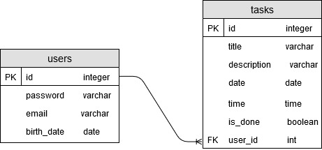

## Tasks API
RESTful API for managing to-do list. It contains the Task resource and the User resource, and corresponding endpoints for CRUD operations. The API is developed for [Tasks](https://github.com/milos-rankovic/tasks-android) Android application.

<b>Built with</b>
- [Java 11](https://adoptopenjdk.net/?variant=openjdk11&jvmVariant=hotspot)
- [Spring framework](https://spring.io/projects/spring-framework)
- [Spring Boot](https://spring.io/projects/spring-boot)
- [Spring DATA JPA](https://spring.io/projects/spring-data-jpa)
- [Jersey as JAX-RS implementation](https://eclipse-ee4j.github.io/jersey/)
- [Jackson for parsing and generating JSON](https://github.com/FasterXML/jackson)
- [PostgreSQL](https://www.postgresql.org/)

## Installation
In order to run the API locally, you should clone the repository and edit the [application.properties](src/main/resources/application.properties) file. Provide the port (default is 8080), data source URL, username and password. After that, run the `mvn install` to download dependencies and start the API running the main method in the [TasksApiApplication](src/main/java/rs/rnk/tasks/rest/TasksApiApplication.java) class. The API will be available at the URL: [http://localhost:8080/](http://localhost:8080/).

Of course, you should have PostgreSQL database running. Database is very simple, with the following ER diagram:

<p align="center">
   
</p>

## API Reference

**API endpoints**

All paths consume and produce data in the JSON format. The API is using basic authentication so you should send username and password in the authorization header (Base64 encoded) and use the API with HTTPS.

`GET /users/{userId}` - Get information about the user with id `userId`.

`DELETE /users/{userId}` - Delete the user with id `userId`.

`POST /users` - Add new user.

`PUT /users/{userId}` - Update the user with id `userId`. You must provide all required user properties.

`PATCH /users/{userId}` - Update the user with id `userId`. You should provide just those properties that you want to update.

`GET /users/login` - Find the user with username and password given in the authorization header. The API doesn't manage the state, so you should handle and store login credentials on the client side.

`GET /users/{userId}/tasks` - Get all tasks for the user with id `userId`.

`POST /users/{userId}/tasks` - Add new task for the user with id `userId`.

`DELETE /users/{userId}/tasks/{taskId}` - Delete the task with id `taskId` for the user with id `userId`.

`DELETE /users/{userId}/tasks` - Delete all tasks for the user with id `userId`.

`PUT /users/{userId}/tasks/{taskId}` - Update the task with id `taskId` for the user with id `userId`. You must provide all required task properties.

`PATCH /users/{userId}/tasks/{taskId}` - Update the task with id `taskId` for the user with id `userId`. You should provide just those properties that you want to update.

**Required fields**

Required fields for the user resource are: `username`, `password`, `email`, `name` and `birthDate`. Required field for the task resource is just `title`.

## How to use

User resource is given in the following JSON format:

```json
{
    "id": 1,
    "username": "username1",
    "password": "password1",
    "email": "user1@test.com",
    "name": "User User",
    "birthDate": "1995-10-18"
}
```

Task resource is given in the following JSON format:

```json
{
    "id": 77,
    "title": "Write readme for tasks project",
    "description": null,
    "date": "2019-10-18",
    "time": "17:00:00",
    "done": false
}
```

Error response template is given in the following JSON format:

```json
{
    "code": 9001,
    "message": "Wrong username or password.",
    "timestamp": "2019-10-21 16:29:10.378"
}
```

## Example

First step is to handle login. For the given username and password you should send the credentials in the authorization header as the Base64 encoded string. If the provided credentials are correct you will get the response back, for example:


```json
{
    "id": 1,
    "username": "username1",
    "password": "password1",
    "email": "user1@test.com",
    "name": "User User",
    "birthDate": "1995-10-18"
}
```

When you receive the user information you should handle the login, and save the credentials on the client side, so you can send the login information for the following requests.

The next step is to send the request and get the tasks. For example, if you send request: `GET users/{userId}/tasks`, you will receive the tasks in the following format:


```json
[
    {
        "id": 77,
        "title": "Write the readme file for tasks API",
        "description": null,
        "date": "2019-10-19",
        "time": "17:00:00",
        "done": false
    },
    {
        "id": 78,
        "title": "Write the readme file for tasks Android app",
        "description": null,
        "date": "2019-10-20",
        "time": "16:20:00",
        "done": false
    }
]
```

When you want to edit the task just send the request `PATCH /users/{userId}/tasks/{taskId}` and provide properties to be edited in the request body. For example, to make the task with `id=77`, for the user with `id=1`, done you should send the request: `PATCH /users/1/tasks/77` and put the following JSON data in the request body:

```json
{
	"done": true
}
```

When you want to add new task for the user with `id=1` you should send the request: `POST /users/1/tasks` and provide the data in the request body:

```json
{
    "title": "Add notifications for the Android app",
    "description": null,
    "date": "2019-10-18",
    "done": false
}
```
